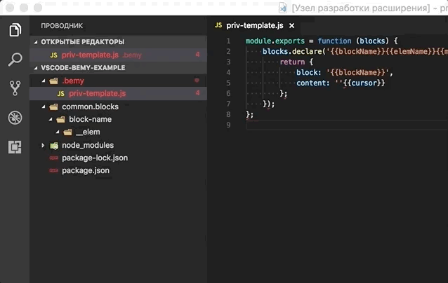

# Bemy for Visual Studio Code

VS Code extention to work with [Bemy](https://github.com/f0rmat1k/bemy)

## Usage

- Right click on folder in the explorer
- Select "New BEM file"
- Enter template name

## TO DO
- [ ] - `rename` task
- [ ] - configurable flags
- [ ] - tasks from editor context menu
- [ ] - key bindings
